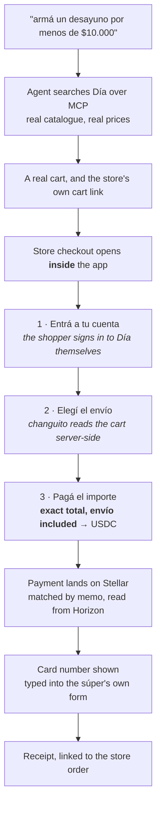
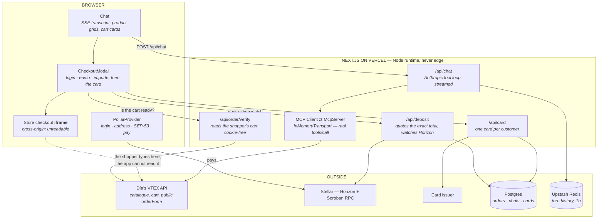

# changuito

**An agent that shops Argentine supermarkets and pays in USDC on Stellar.**

You ask for a basket in plain Spanish. It searches a real store over MCP,
compares real prices, builds a real cart, and then hands you the store's own
checkout — inside the app. You pay the exact total in USDC, envío included, and
changuito gives you a card number to type into the súper's payment form.

*changuito* is what an Argentine calls a shopping trolley.

| | |
|---|---|
| **Try it** | [app.changuito.me](https://app.changuito.me) — no wallet needed to shop |
| **Marketing site** | [www.changuito.me](https://www.changuito.me) |
| **Reviewing this?** | **[docs/judges.md](docs/judges.md)** — a 15-minute path through the repo, and what to check |
| **License** | MIT |

> **Two products, one bundle.** Signed out, you are in **preview**: testnet, and
> we pay from a wallet we hold. Signed in with Pollar, you are in
> **production**: mainnet, real USDC, your wallet. Nothing toggles that — the
> Pollar session *is* the crossing. See [`lib/app-mode.ts`](apps/web/lib/app-mode.ts).

---

## The problem

An Argentine supermarket takes pesos through a card form. Somebody holding
dollars on Stellar cannot pay with them, and the gap is not a swap — it is the
whole last mile: the store wants a card, at a peso amount that is not known
until a delivery slot is picked, from a person whose profile the store already
holds.

changuito closes that last mile without asking the store to change anything and
without taking custody of the shop. The store's real checkout runs in the app.
The money moves on Stellar. A card bridges the two.

## What the shopper does



The order of those three steps is the whole point, and it used to be wrong: the
USDC was quoted before a delivery slot existed, so it excluded envío. `cart.total`
is the goods subtotal *by design* — see
[`orderform.ts`](packages/mcp/src/adapters/orderform.ts). Now nothing is quoted
until the store itself says what the basket costs.

---

## What is on Stellar, and what it is doing

Full detail in **[docs/stellar.md](docs/stellar.md)**. The short version:

| | Doing |
|---|---|
| **Classic USDC payment + memo** | the money rail. One payment to an operator account, identified by a `código` in the memo. No contract, no server signing key, no custody of anything but the deposit account |
| **Horizon** | the *only* confirmation source. `lib/deposit-watch.ts` reads the public ledger — there is no webhook to miss and no secret to hold. Anyone can verify a deposit themselves |
| **SEP-53 signed messages** | identity, everywhere it matters. Every gate that can spend real money checks a signature over a message naming the address, not an address the browser claims |
| **SEP-41 Soroban token** | `contracts/mock_usdc` — the testnet demo token, admin-gated mint. It backs the faucet route and the escrow, and deliberately *not* the deposit rail: a contract token has no classic payment record for a memo to ride on |
| **SEP-7 URI** | the receive screen's payment link |
| **Soroban escrow** | `contracts/escrow` — deployed, 19 tests, **dormant**. See below |
| **Pollar wallet** | login, the address, the SEP-53 signature, and the USDC payment |
| **stellar.expert** | every transaction the app shows is linked to the explorer |

### Why a payment and not the escrow

The escrow is deployed on testnet and it is good code. It is also not on the
money rail, and the honest reason is written in
[`lib/deposit.ts`](apps/web/lib/deposit.ts):

> *The thing the order actually needs is much smaller than an escrow: the money
> has to arrive before a card is issued against it. A classic payment with a
> memo does that with no contract, no resolver key on the server, and nothing to
> deploy.*
>
> *It also means the failure path is honest. There is no automated outbound
> payment here and no Stellar secret in the deployment, so a failed order is
> refunded by hand. That is a worse product and a much better blast radius.*

The escrow's `open / settle / refund` still work and are still tested — they are
reachable from `/dev/ui`, not from the shopper's path. What it was built for, and
the case for bringing it back on the mainnet rail, is in
[docs/stellar.md](docs/stellar.md#the-escrow-contract-dormant).

---

## Architecture at a glance



**The cross-origin wall is the central design constraint.** The store's checkout
runs in an iframe and the app cannot read its DOM, its URL, or whether it
finished. So every reading of the shopper's cart is taken **server-side** from
VTEX's *public* `orderForm` endpoint, with no cookies — the total, whether a
delivery slot was picked, and `orderGroup`, which is the one unambiguous signal
that an order exists. Nothing about the shopper's profile ever crosses back out
of that read; `lib/test/order-check.test.ts` pins that as a rule.

**The MCP server is the other half of the point.** `packages/mcp` is a real
Model Context Protocol server for four Argentine VTEX supermarkets — it was
written first, and changuito exists to drive it from something other than a chat
client. The web app speaks to it over `InMemoryTransport`: the actual protocol
(`initialize`, `tools/list`, `tools/call`) with a pair of queues instead of a
pipe. Its checkout half opens a headed browser on the host, so it cannot run on
Vercel at all — three independent barriers keep Playwright out of the lambda.

More: **[docs/architecture.md](docs/architecture.md)**.

---

## Where this is honest about itself

Read this before the demo, not after it.

- **The card is not funded by the deposit.** The issuer's API answers `403
  "Contact support via email to enable your API"` on every endpoint, so no card
  is minted programmatically. One card exists, made by hand in the issuer's
  dashboard, and its numbers are read out of a `shared_card` row by the wallets
  on a member list. The deposit is real, the card is real, and **the link
  between them is operator-run.** No copy in the app claims a load happened —
  see [`lib/shared-card.ts`](apps/web/lib/shared-card.ts) and
  `supabase/migrations/0004_shared_card.sql`.
- **A failed order is refunded by hand.** There is no automated outbound payment
  and no Stellar secret in the production deployment. That is a deliberate
  trade: worse product, much smaller blast radius.
- **The store-reading leg cannot be exercised on testnet.** Día has no test
  environment and the `/dev/checkout` rehearsal fixture has no orderForm, so the
  e2e covers the app's own order of operations and the mainnet leg is a hand
  check. The checklist is in [docs/e2e.md](docs/e2e.md).
- **The receipt's order link infers one character.** `orderRef` is
  `${orderGroup}-01`, from VTEX's single-seller convention. Día is single-seller
  and the guess has held, but it is a guess, and it degrades to the order *list*
  rather than a 404.
- **The escrow is dormant**, not deleted. See above.
- **The store's catalogue is live.** Prices and stock on any given day are
  whatever Día actually has.
- **The commit dates are backdated** to the window the work was planned over.

---

## Deployed on testnet

Live since **2026-09-21**. `deployments.json` is the single source of truth for
contract ids, and `stellar.test.ts` compares it against the ids baked into the
generated bindings — so a redeploy that half-lands fails the suite rather than
the demo.

| | |
|---|---|
| **escrow** *(dormant)* | [`CBCUESHDKRXAH4YAHOKJFRFEOIYBTU2LYJ4LCOFIGMYGNHBCPACXQ557`](https://stellar.expert/explorer/testnet/contract/CBCUESHDKRXAH4YAHOKJFRFEOIYBTU2LYJ4LCOFIGMYGNHBCPACXQ557) |
| **demo USDC** — SEP-41, `USDC`, 7 decimals | [`CB63C7UVZ3PBALQ7IE37QU2ZX5X3UMTLJOHDRI2EW44JU26YDGLQUBJF`](https://stellar.expert/explorer/testnet/contract/CB63C7UVZ3PBALQ7IE37QU2ZX5X3UMTLJOHDRI2EW44JU26YDGLQUBJF) |
| **resolver** — token admin, escrow resolver | [`GBGMPRHU3NW3BCXUNDNC7VSYQKS6FZKWFHSGEHHMR3G3TZOUWEDBHTFK`](https://stellar.expert/explorer/testnet/account/GBGMPRHU3NW3BCXUNDNC7VSYQKS6FZKWFHSGEHHMR3G3TZOUWEDBHTFK) |
| **treasury** — receives settled baskets | [`GAXUICH5DZMB4ZIZVF6ETTE524RCZYRKHWLGG7EOLY6ECVD4IS6TBNZG`](https://stellar.expert/explorer/testnet/account/GAXUICH5DZMB4ZIZVF6ETTE524RCZYRKHWLGG7EOLY6ECVD4IS6TBNZG) |

Network passphrase `Test SDF Network ; September 2015`, RPC
`https://soroban-testnet.stellar.org`. The deposit accounts are configuration
(`DEPOSIT_ADDRESS_TESTNET` / `DEPOSIT_ADDRESS_MAINNET`), not committed — mainnet
has no contracts deployed and needs none for the payment rail.

The escrow's constructor wired resolver, treasury and token in at deploy time and
there is no setter, so who can settle and where the money lands are fixed. You do
not have to take that from a README — ask the contract:

```bash
stellar contract invoke --network testnet \
  --id CBCUESHDKRXAH4YAHOKJFRFEOIYBTU2LYJ4LCOFIGMYGNHBCPACXQ557 \
  --source-account GBGMPRHU3NW3BCXUNDNC7VSYQKS6FZKWFHSGEHHMR3G3TZOUWEDBHTFK \
  --send=no -- config
```
```json
{"resolver":"GBGMPRHU…DBHTFK","token":"CB63C7UV…LQUBJF","treasury":"GAXUICH5…S6TBNZG"}
```

`--send=no` only simulates, so it signs nothing, costs nothing, and any funded
account will do as `--source-account`.

## Verified on testnet

Not by inspection — these are ledger entries:

| | |
|---|---|
| escrow open | [`a72b4f33…`](https://stellar.expert/explorer/testnet/tx/a72b4f33bc155b8de1b2f2c15a975b31a04048a3bc6f881bc306e8a1080782a2) — 3.44 USDC buyer → escrow |
| escrow settle | [`3410b8a0…`](https://stellar.expert/explorer/testnet/tx/3410b8a01e913b4613a5c23568392ad3d707e29f42bbdf0aa7a02cb09f3e68c3) — escrow → treasury, receipt recorded |
| escrow refund | [`a64fb38a…`](https://stellar.expert/explorer/testnet/tx/a64fb38ac495112ff0fbc798fb45df67f945a4781cd80d6334155496581627c8) — escrow → buyer, balance back to the stroop |
| faucet | [`03baa469…`](https://stellar.expert/explorer/testnet/tx/03baa469c514406487ea29c32da076d8c8af7725c2a67fb73f5f8ad056ca215a) — friendbot, then 50 USDC minted |

And the escrow receipt is checkable by hand. The settle above stored
`881ae41cb172e10778dd6810e5c3e9be5fef54b266cb0686f4da446109f978d0`, which is:

```bash
printf 'changuito/receipt/v1\nretailer|dia\ncart|live-check-1\nhandoff|https://diaonline.supermercadosdia.com.ar/checkout?orderFormId=live-check-1\nsettled|2026-09-21T07:22:14.394Z\n' | shasum -a 256
```

---

## Setup

Requires **Node ≥ 22.12** (`.nvmrc` pins 22.12.0). For the contracts, Rust with
the `wasm32v1-none` target and the
[Stellar CLI](https://developers.stellar.org/docs/tools/developer-tools/cli/stellar-cli).

```bash
git clone https://github.com/tote-hq/stellar
cd stellar
npm install

cp apps/web/.env.example apps/web/.env.local
# fill in ANTHROPIC_API_KEY; everything else is optional to start

npm run dev            # http://localhost:3124
```

**It degrades rather than breaking.** With only `ANTHROPIC_API_KEY` set you get
search, comparison, carts and the store handoff. Without
`NEXT_PUBLIC_POLLAR_API_KEY_MAINNET` the masthead reads *"Billetera: sin
configurar"* instead of a balance. Without `DATABASE_URL` the card and order
tables are simply absent and every reader answers "nothing" — deliberately, not
defensively. Without `KV_REST_API_*` conversation history falls back to an
in-process `Map`.

The contracts are already deployed; you only need to redeploy if you change
them. See **[DEPLOY.md](DEPLOY.md)** for that and for putting it on Vercel.

### Environment

The annotated list is `apps/web/.env.example`. The ones that change what works:

| Variable | Where | Required for |
|---|---|---|
| `ANTHROPIC_API_KEY` | server | the agent |
| `NEXT_PUBLIC_POLLAR_API_KEY_MAINNET` | browser | login, wallet, SEP-53, paying |
| `DEPOSIT_ADDRESS_TESTNET` / `_MAINNET` | server | the deposit rail. Missing → `/api/deposit` 503s and logs the variable name |
| `DATABASE_URL` | server | orders, kept cards, chat archive |
| `VYRION_API_KEY` | server | card issuance (currently 403 — see the honesty section) |
| `STELLAR_RESOLVER_SECRET` | server | the testnet faucet and the escrow |
| `KV_REST_API_URL` / `_TOKEN` | server | conversation history across restarts |
| `REAL_MODE_ALLOWLIST_ADDRESSES` | server | who may reach mainnet. Empty in production means nobody |
| `FX_ARS_PER_USD` | server | optional — pins the rate for a reproducible demo |
| `AGENT_EFFORT` | server | optional — `low` (default), `medium`, `high`. The latency knob |

---

## Tests

```bash
npm test                    # 1178: mcp 520 · trust 2 · web 583 · landing 73
npm run contracts:test      #   34: escrow 19 · mock_usdc 15
npm run typecheck -w @changuito/web
npm run build
npm run test:e2e            # Playwright — see docs/e2e.md
```

The suites are treated as a fixed point rather than a formality: a change that
only passes because its test moved with it tells you nothing once it is live, so
a test that has to change is named out loud in the commit that changes it.

Four that guard mistakes which type-check cleanly:

- **`order-check.test.ts`** pins that nothing about the shopper's profile or
  address can cross out of the server-side cart read — checked against fixtures
  that are trimmed copies of what Día actually returned, which include an email,
  a name and a DNI. That endpoint hands all three to anyone holding a cart id.
- **`order.test.ts`** reads `pub fn open` out of `contracts/escrow/src/lib.rs`
  and compares argument names, Rust types and timeout bounds against the
  encoder. Soroban arguments are positional and two of them are `BytesN<32>` —
  swap `order_id` and `basket_hash` and everything compiles, deploys, and then
  settles a basket nobody approved.
- **`stellar.test.ts`** reads the contract ids baked into the generated bindings
  as text and compares them with `deployments.json`.
- **`app-frame-checkout.spec.ts`** drives the whole checkout in a browser and
  pins that the basket is quoted **exactly once**, and never before the shopper
  has signed in — which is the property the envío bug violated. It runs with
  `trace / video / screenshot` off, because the repo is public and the spec walks
  past a test PAN.

The contract suite covers what the money depends on: a double open is rejected,
settling an order that was never opened is rejected, an unauthorized settle is
rejected, a buyer refunding before the deadline is rejected, after it is allowed,
and balances reconcile exactly across both `open → settle` and `open → refund`.

---

## Layout

```
apps/web/            the shopper — chat, checkout, card, API routes (app.changuito.me)
apps/landing/        marketing site only (www.changuito.me)
apps/branding/       brand kit (not an npm package): logo, mascot, manuals, social
packages/mcp/        the supermarket MCP server (vendored, 520 tests)
packages/trust/      footer trust copy shared by both apps, so they cannot drift
packages/*-bindings/ generated TypeScript clients for the two contracts
contracts/escrow/    open / settle / refund, with events — dormant
contracts/mock_usdc/ SEP-41 token, admin-gated mint
supabase/migrations/ orders, chats, cards — the reasoning is in the SQL
scripts/             deploy.sh, the demo asset issuer, db migrate + invariants
creatives/           Remotion sources for the pitch videos (ES, EN, promo)
e2e/                 Playwright: the checkout, and smoke against the live sites
deployments.json     what is deployed, and where — committed on purpose
```

### Deeper documentation

| | |
|---|---|
| **[docs/judges.md](docs/judges.md)** | reviewing this in 15 minutes: what to look at, and what to check |
| [docs/architecture.md](docs/architecture.md) | the system, the trust boundaries, and the cross-origin wall |
| [docs/flows.md](docs/flows.md) | a chat turn, the deposit, the card, the receipt — end to end |
| [docs/stellar.md](docs/stellar.md) | every Stellar technology used and what each is doing |
| [docs/tech-stack.md](docs/tech-stack.md) | the dependency list with versions, and why each one is there |
| [docs/e2e.md](docs/e2e.md) | Playwright, and the mainnet checks the e2e cannot cover |
| [DEPLOY.md](DEPLOY.md) | the contracts, then Vercel, then the database |
| [CLAUDE.md](CLAUDE.md) | how the agent's behaviour was arrived at, and which decisions not to undo |
